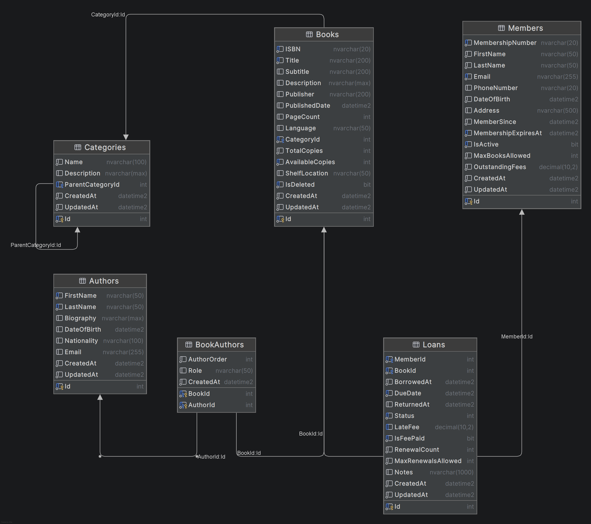

# 05 - Initial Database Schema

## 📖 What You'll Learn

- Database schema design for a real-world application
- SQL Server data types and their C# equivalents
- Primary and foreign key relationships
- CHECK constraints for business rule enforcement
- Database normalization (3NF) principles
- Idempotent migration patterns
- Forward-only migration philosophy

## 🎯 Why This Matters

The database schema is the **foundation** of your application. A well-designed schema:

- **Ensures data integrity** through constraints and relationships
- **Optimizes performance** with proper indexing
- **Scales gracefully** as requirements evolve
- **Prevents data corruption** with proper normalization

> "A bad database design can doom a project before a single line of application code is written." - Bill Karwin

**This is not just about storing data** - it's about modeling your business domain in a way that ensures correctness, performance, and maintainability.

## 🗂️ Schema Overview

Our Library Management System consists of **6 tables** organized into 3 logical groups:

### Core Entities
1. **Categories** - Book classification with hierarchical support
2. **Authors** - Author biographical information
3. **Books** - Book catalog with inventory management

### Membership & Operations
4. **Members** - Library member accounts
5. **Loans** - Book borrowing transactions

### Relationships
6. **BookAuthors** - Many-to-many junction between Books and Authors

### Entity Relationship Diagram (Conceptual)

```
Categories (self-referencing)
    ↓ (1:N)
Books ←→ BookAuthors ←→ Authors (M:N via junction table)
    ↓ (1:N)
Loans
    ↓ (N:1)
Members
```

**Key relationships:**
- A Category can have **many child Categories** (hierarchical)
- A Book belongs to **one Category**
- A Book can have **many Authors** (via BookAuthors)
- An Author can write **many Books** (via BookAuthors)
- A Member can have **many Loans**
- A Book can have **many Loans**
- A Loan belongs to **one Member** and **one Book**

## 📋 Table Structures



### 1. Categories Table

**Purpose:** Organize books into hierarchical categories (e.g., Fiction → Science Fiction)

| Column | Type | Nullable | Description |
|--------|------|----------|-------------|
| Id | INT IDENTITY | ❌ | Primary key |
| Name | NVARCHAR(100) | ❌ | Category name |
| Description | NVARCHAR(MAX) | ✅ | Category description |
| ParentCategoryId | INT | ✅ | Self-referencing FK (for sub-categories) |
| CreatedAt | DATETIME2(7) | ❌ | Audit timestamp |
| UpdatedAt | DATETIME2(7) | ❌ | Audit timestamp |

**Relationships:**
- `ParentCategoryId` → `Categories.Id` (self-referencing, allows unlimited nesting)

**Example hierarchy:**
```
Fiction (ParentCategoryId = NULL)
  ├─ Science Fiction (ParentCategoryId = 1)
  ├─ Mystery (ParentCategoryId = 1)
  └─ Fantasy (ParentCategoryId = 1)
```

### 2. Authors Table

**Purpose:** Store author biographical information

| Column | Type | Nullable | Description |
|--------|------|----------|-------------|
| Id | INT IDENTITY | ❌ | Primary key |
| FirstName | NVARCHAR(50) | ❌ | Author's first name |
| LastName | NVARCHAR(50) | ❌ | Author's last name |
| Biography | NVARCHAR(MAX) | ✅ | Author biography |
| DateOfBirth | DATETIME2(7) | ✅ | Birth date (for age calculation) |
| Nationality | NVARCHAR(100) | ✅ | Author's nationality |
| Email | NVARCHAR(255) | ✅ | Contact email (optional for privacy) |
| CreatedAt | DATETIME2(7) | ❌ | Audit timestamp |
| UpdatedAt | DATETIME2(7) | ❌ | Audit timestamp |

**Why nullable fields?**
- Not all author information may be available (e.g., historical authors)
- Privacy concerns (email)
- Flexibility for incomplete records

### 3. Books Table

**Purpose:** Core book catalog with inventory tracking

| Column | Type | Nullable | Description |
|--------|------|----------|-------------|
| Id | INT IDENTITY | ❌ | Primary key |
| ISBN | NVARCHAR(20) | ❌ | ISBN-10 or ISBN-13 (unique business key) |
| Title | NVARCHAR(200) | ❌ | Book title |
| Subtitle | NVARCHAR(200) | ✅ | Book subtitle |
| Description | NVARCHAR(MAX) | ✅ | Book description/summary |
| Publisher | NVARCHAR(200) | ✅ | Publisher name |
| PublishedDate | DATETIME2(7) | ✅ | Publication date |
| PageCount | INT | ✅ | Number of pages |
| Language | NVARCHAR(50) | ✅ | Language code/name |
| CategoryId | INT | ❌ | FK to Categories |
| TotalCopies | INT | ❌ | Total number of copies owned |
| AvailableCopies | INT | ❌ | Currently available for borrowing |
| ShelfLocation | NVARCHAR(50) | ✅ | Physical location in library |
| IsDeleted | BIT | ❌ | Soft delete flag (default: 0) |
| CreatedAt | DATETIME2(7) | ❌ | Audit timestamp |
| UpdatedAt | DATETIME2(7) | ❌ | Audit timestamp |

**Relationships:**
- `CategoryId` → `Categories.Id`

**Business Rules (CHECK constraints):**
- `AvailableCopies >= 0 AND AvailableCopies <= TotalCopies`
- `TotalCopies >= 0`
- `PageCount IS NULL OR PageCount > 0`

**Unique Index:**
- `ISBN` must be unique (UQ_Books_ISBN in V002)

### 4. Members Table

**Purpose:** Library membership records and account management

| Column | Type | Nullable | Description |
|--------|------|----------|-------------|
| Id | INT IDENTITY | ❌ | Primary key |
| MembershipNumber | NVARCHAR(20) | ❌ | Unique business identifier (e.g., LIB-2024-001) |
| FirstName | NVARCHAR(50) | ❌ | Member's first name |
| LastName | NVARCHAR(50) | ❌ | Member's last name |
| Email | NVARCHAR(255) | ❌ | Email (normalized to lowercase) |
| PhoneNumber | NVARCHAR(20) | ✅ | Contact phone |
| DateOfBirth | DATETIME2(7) | ❌ | Birth date (for age verification) |
| Address | NVARCHAR(500) | ✅ | Mailing address |
| MemberSince | DATETIME2(7) | ❌ | Membership start date |
| MembershipExpiresAt | DATETIME2(7) | ❌ | Membership expiration date |
| IsActive | BIT | ❌ | Account active status (default: 1) |
| MaxBooksAllowed | INT | ❌ | Max books they can borrow (default: 5) |
| OutstandingFees | DECIMAL(10,2) | ❌ | Total unpaid fees (default: 0.00) |
| CreatedAt | DATETIME2(7) | ❌ | Audit timestamp |
| UpdatedAt | DATETIME2(7) | ❌ | Audit timestamp |

**Business Rules (CHECK constraints):**
- `MaxBooksAllowed > 0`
- `OutstandingFees >= 0`
- `MembershipExpiresAt > MemberSince`

**Unique Indexes:**
- `MembershipNumber` must be unique (UQ_Members_MembershipNumber in V002)
- `Email` must be unique (UQ_Members_Email in V002)

**Why DECIMAL(10,2) for fees?**
- Exact precision for monetary values (no floating-point errors!)
- 10 total digits, 2 after decimal point → Max: $99,999,999.99

### 5. Loans Table

**Purpose:** Track book borrowing history and status

| Column | Type | Nullable | Description |
|--------|------|----------|-------------|
| Id | INT IDENTITY | ❌ | Primary key |
| MemberId | INT | ❌ | FK to Members |
| BookId | INT | ❌ | FK to Books |
| BorrowedAt | DATETIME2(7) | ❌ | When book was borrowed |
| DueDate | DATETIME2(7) | ❌ | When book is due back |
| ReturnedAt | DATETIME2(7) | ✅ | When book was returned (NULL = still out) |
| Status | INT | ❌ | LoanStatus enum (0-6) |
| LateFee | DECIMAL(10,2) | ✅ | Late fee amount ($0.50/day) |
| IsFeePaid | BIT | ❌ | Whether late fee has been paid |
| RenewalCount | INT | ❌ | Number of times renewed (default: 0) |
| MaxRenewalsAllowed | INT | ❌ | Max renewals permitted (default: 2) |
| Notes | NVARCHAR(1000) | ✅ | Additional notes (damage, loss, etc.) |
| CreatedAt | DATETIME2(7) | ❌ | Audit timestamp |
| UpdatedAt | DATETIME2(7) | ❌ | Audit timestamp |

**Relationships:**
- `MemberId` → `Members.Id` (ON DELETE NO ACTION - preserve history)
- `BookId` → `Books.Id` (ON DELETE NO ACTION - preserve history)

**LoanStatus Enum Values:**
```
0 = Active      - Book currently borrowed
1 = Returned    - Returned on time
2 = Overdue     - Not returned by due date
3 = ReturnedLate - Returned after due date
4 = Lost        - Member reported book lost
5 = Damaged     - Returned with damage
6 = Cancelled   - Loan cancelled
```

**Business Rules (CHECK constraints):**
- `DueDate > BorrowedAt`
- `ReturnedAt IS NULL OR ReturnedAt >= BorrowedAt`
- `Status >= 0 AND Status <= 6`
- `LateFee IS NULL OR LateFee >= 0`
- `RenewalCount >= 0`
- `RenewalCount <= MaxRenewalsAllowed`

**Why preserve loan history?**
- Even if a member account is deleted, we keep loan records for audit purposes
- Historical data for reporting and analytics

### 6. BookAuthors Table (Junction/Bridge Table)

**Purpose:** Many-to-many relationship between Books and Authors

| Column | Type | Nullable | Description |
|--------|------|----------|-------------|
| BookId | INT | ❌ | FK to Books (part of composite PK) |
| AuthorId | INT | ❌ | FK to Authors (part of composite PK) |
| AuthorOrder | INT | ❌ | Order of authors (1st, 2nd, 3rd, etc.) |
| Role | NVARCHAR(50) | ✅ | Author role (e.g., "Editor", "Translator") |
| CreatedAt | DATETIME2(7) | ❌ | Audit timestamp |

**Relationships:**
- `BookId` → `Books.Id` (ON DELETE CASCADE)
- `AuthorId` → `Authors.Id` (ON DELETE CASCADE)

**Composite Primary Key:** `(BookId, AuthorId)`

**Why CASCADE DELETE?**
- If a book is deleted, remove all its author associations automatically
- If an author is deleted, remove all their book associations automatically
- This is appropriate for junction tables

**Example:**
```sql
-- The Pragmatic Programmer has 2 authors
BookId=5, AuthorId=5, AuthorOrder=0, Role='Author'      -- Andrew Hunt
BookId=5, AuthorId=6, AuthorOrder=1, Role='Co-Author'   -- David Thomas
```

## 🔍 SQL Server Data Types Explained

### String Types

| SQL Server Type | C# Type | Usage | Max Size |
|----------------|---------|-------|----------|
| NVARCHAR(n) | string | Unicode text (supports all languages) | 4,000 chars |
| NVARCHAR(MAX) | string | Large text (descriptions, biographies) | 2 GB |

**Why NVARCHAR instead of VARCHAR?**
- `NVARCHAR` stores Unicode (UTF-16) - supports all languages (Chinese, Arabic, etc.)
- `VARCHAR` stores ASCII only - limited to English/Latin characters
- Modern apps should default to `NVARCHAR` for internationalization

### Numeric Types

| SQL Server Type | C# Type | Usage | Range |
|----------------|---------|-------|-------|
| INT | int | Whole numbers (IDs, counts) | -2.1B to 2.1B |
| DECIMAL(10,2) | decimal | Money (exact precision) | ±99,999,999.99 |

**Why DECIMAL for money, not FLOAT?**
```sql
-- FLOAT has rounding errors (BAD for money!)
SELECT 0.1 + 0.2  -- Result: 0.30000000000000004

-- DECIMAL is exact (GOOD for money!)
SELECT CAST(0.1 AS DECIMAL(10,2)) + CAST(0.2 AS DECIMAL(10,2))  -- Result: 0.30
```

### Date/Time Types

| SQL Server Type | C# Type | Precision | Storage |
|----------------|---------|-----------|---------|
| DATETIME2(7) | DateTime | 100 nanoseconds | 8 bytes |

**Why DATETIME2(7) instead of DATETIME?**
- `DATETIME2` has better precision and range
- `DATETIME` limited to 1753-9999, rounded to .000, .003, or .007 seconds
- `DATETIME2(7)` covers 0001-9999 with 100ns precision
- Modern SQL Server apps should use `DATETIME2`

**Why UTC (SYSUTCDATETIME)?**
- Avoids time zone confusion
- C# `DateTime.UtcNow` maps directly
- Convert to local time in application layer

### Boolean Type

| SQL Server Type | C# Type | Values |
|----------------|---------|--------|
| BIT | bool | 0 (false) or 1 (true) |

## 🔗 Relationships & Foreign Keys

### One-to-Many (1:N)

**Example:** One Category has many Books
```sql
CONSTRAINT [FK_Books_Categories] FOREIGN KEY ([CategoryId])
    REFERENCES [dbo].[Categories] ([Id])
    ON DELETE NO ACTION
```

**ON DELETE NO ACTION** means:
- Cannot delete a Category if Books reference it
- Prevents accidental data loss
- Must delete child Books first, then parent Category

### Many-to-Many (M:N)

**Example:** Books ↔ Authors (via BookAuthors junction table)

```
Books Table          BookAuthors Table       Authors Table
+---------+          +--------+----------+    +---------+
| Id      |          | BookId | AuthorId |    | Id      |
+---------+   ←───   +--------+----------+    +---------+
                              └─────────────→
```

**Why a junction table?**
- SQL doesn't support direct M:N relationships
- Junction table breaks it into two 1:N relationships
- Allows additional attributes (AuthorOrder, Role)

### Self-Referencing (Hierarchical)

**Example:** Category can have parent Category

```sql
CONSTRAINT [FK_Categories_ParentCategory] FOREIGN KEY ([ParentCategoryId])
    REFERENCES [dbo].[Categories] ([Id])
    ON DELETE NO ACTION
```

Allows unlimited nesting:
```
Technology (Id=5, ParentCategoryId=NULL)
  └─ Programming (Id=11, ParentCategoryId=5)
      └─ Web Development (hypothetical: ParentCategoryId=11)
```

## 📏 Business Rules & Constraints

### CHECK Constraints

Enforce business logic **at the database level**:

```sql
-- Books: Available copies can't exceed total copies
CONSTRAINT [CK_Books_AvailableCopies]
    CHECK ([AvailableCopies] >= 0 AND [AvailableCopies] <= [TotalCopies])

-- Members: Can't owe negative fees
CONSTRAINT [CK_Members_OutstandingFees]
    CHECK ([OutstandingFees] >= 0)

-- Loans: Due date must be after borrowed date
CONSTRAINT [CK_Loans_DueDate]
    CHECK ([DueDate] > [BorrowedAt])
```

**Benefits:**
- **Last line of defense** - even if app has bugs, database prevents invalid data
- **Centralized** - rule defined once, enforced everywhere
- **Performance** - checked during INSERT/UPDATE, not on every SELECT

### UNIQUE Constraints (via Indexes)

Prevent duplicates on business keys:

```sql
-- ISBN must be unique across all books
CREATE UNIQUE INDEX [UQ_Books_ISBN] ON [Books] ([ISBN])

-- Each member has unique membership number and email
CREATE UNIQUE INDEX [UQ_Members_MembershipNumber] ON [Members] ([MembershipNumber])
CREATE UNIQUE INDEX [UQ_Members_Email] ON [Members] ([Email])
```

**Difference from PRIMARY KEY:**
- PK is for database identity (surrogate key)
- UNIQUE is for business uniqueness (natural key)

## 🗃️ Database Normalization

Our schema follows **Third Normal Form (3NF)** principles:

### First Normal Form (1NF)
✅ **Each column contains atomic (single) values**
- No "Authors" column with comma-separated names
- Instead: BookAuthors junction table

### Second Normal Form (2NF)
✅ **No partial dependencies on composite keys**
- In BookAuthors: AuthorOrder and Role depend on BOTH BookId AND AuthorId
- Not just one part of the key

### Third Normal Form (3NF)
✅ **No transitive dependencies**
- Book doesn't store Category Name (would duplicate data)
- Book stores CategoryId (references Categories table)

### Example of Normalization

**❌ De-normalized (bad):**
| BookId | Title | AuthorName | AuthorEmail | CategoryName |
|--------|-------|------------|-------------|--------------|
| 1 | Clean Code | Robert Martin | unclebob@... | Programming |
| 2 | Refactoring | Martin Fowler | fowler@... | Programming |

**Problems:**
- "Programming" duplicated many times
- If author email changes, update many rows
- What if book has 2 authors?

**✅ Normalized (good):**
```
Books: BookId, Title, CategoryId (FK)
Authors: AuthorId, Name, Email
Categories: CategoryId, Name
BookAuthors: BookId (FK), AuthorId (FK), Order
```

**Benefits:**
- Each piece of data stored once
- Updates happen in one place
- Easy to add multiple authors

## 🔄 Migration Philosophy

### Forward-Only Migrations

**Principle:** Once a migration is applied, NEVER modify it. Create a new migration to fix issues.

**Why?**
```
Developer A's DB: V001 ✅ → V002 ✅ → V003 ✅
Developer B's DB: V001 ✅ → V002 ✅ → ??? (modified V002 doesn't match!)
Production DB:    V001 ✅ → ??? (can't apply modified V002!)
```

**Example:**
```sql
-- ❌ WRONG: Modifying V001__initial_schema.sql to add a column
ALTER TABLE Books ADD NewColumn NVARCHAR(100);

-- ✅ RIGHT: Create V004__add_book_new_column.sql
```

### Idempotent Migrations

**Principle:** Migrations should be safe to run multiple times.

**Pattern:**
```sql
-- Check if table exists before creating
IF NOT EXISTS (SELECT * FROM sys.objects WHERE object_id = OBJECT_ID(N'[dbo].[Books]'))
BEGIN
    CREATE TABLE [dbo].[Books] (...)
    PRINT '✅ Table created'
END
ELSE
BEGIN
    PRINT 'ℹ️  Table already exists'
END
```

**Why?**
- Safe to re-run on dev/test environments
- No "table already exists" errors
- Easy recovery from partial failures

### MERGE for Seed Data

**Pattern:**
```sql
MERGE INTO [dbo].[Categories] WITH (HOLDLOCK) AS target
USING (VALUES (1, 'Fiction', 'Narrative works', NULL)) AS source
ON target.[Id] = source.[Id]
WHEN NOT MATCHED BY TARGET THEN INSERT (...)
```

**Benefits:**
- Idempotent: Running twice doesn't create duplicates
- `HOLDLOCK` prevents race conditions in concurrent environments
- Updates existing rows if needed (WHEN MATCHED)

## 🚀 Running Migrations

### Manual Execution (for now)

We'll build a MigrationRunner in a later commit. For now, run manually:

**Using SQL Server Management Studio (SSMS):**
1. Connect to localhost,1453 (SQL Server in Docker)
2. Open migration file (V001, V002, V003)
3. Press F5 to execute
4. Verify output messages

**Using Azure Data Studio:**
1. Connect to Server: `localhost,1453`
2. Database: `LibraryDb`
3. Open .sql file
4. Click "Run" button
5. Check "Messages" tab for success

**Using sqlcmd (command line):**
```bash
# Run from project root
sqlcmd -S localhost,1453 -U sa -P YourPassword123! -i migrations/V001__initial_schema.sql
sqlcmd -S localhost,1453 -U sa -P YourPassword123! -i migrations/V002__add_indexes.sql
sqlcmd -S localhost,1453 -U sa -P YourPassword123! -i migrations/V003__seed_data.sql
```

### Migration Order (Important!)

**Must run in sequence:**
1. ✅ V000__create_app_user.sql (creates database and user)
2. ✅ V001__initial_schema.sql (creates tables)
3. ✅ V002__add_indexes.sql (creates indexes)
4. ✅ V003__seed_data.sql (inserts sample data)

**Why this order?**
- Can't create tables without database (V000)
- Can't create indexes without tables (V001)
- Can't insert data without tables (V001)

## 📊 Verifying the Schema

After running migrations, verify with these queries:

```sql
-- List all tables
SELECT TABLE_NAME
FROM INFORMATION_SCHEMA.TABLES
WHERE TABLE_TYPE = 'BASE TABLE'
ORDER BY TABLE_NAME;

-- Count rows in each table
SELECT 'Categories' AS TableName, COUNT(*) AS RowCount FROM Categories
UNION ALL SELECT 'Authors', COUNT(*) FROM Authors
UNION ALL SELECT 'Books', COUNT(*) FROM Books
UNION ALL SELECT 'Members', COUNT(*) FROM Members
UNION ALL SELECT 'Loans', COUNT(*) FROM Loans
UNION ALL SELECT 'BookAuthors', COUNT(*) FROM BookAuthors;

-- View foreign key relationships
SELECT
    fk.name AS ForeignKeyName,
    tp.name AS ParentTable,
    cp.name AS ParentColumn,
    tr.name AS ReferencedTable,
    cr.name AS ReferencedColumn
FROM sys.foreign_keys AS fk
INNER JOIN sys.tables AS tp ON fk.parent_object_id = tp.object_id
INNER JOIN sys.tables AS tr ON fk.referenced_object_id = tr.object_id
INNER JOIN sys.foreign_key_columns AS fkc ON fk.object_id = fkc.constraint_object_id
INNER JOIN sys.columns AS cp ON fkc.parent_column_id = cp.column_id AND fkc.parent_object_id = cp.object_id
INNER JOIN sys.columns AS cr ON fkc.referenced_column_id = cr.column_id AND fkc.referenced_object_id = cr.object_id
ORDER BY tp.name, fk.name;

-- Test a simple query (books with categories and authors)
SELECT
    b.Title,
    b.ISBN,
    c.Name AS Category,
    STRING_AGG(a.FirstName + ' ' + a.LastName, ', ') AS Authors
FROM Books b
INNER JOIN Categories c ON b.CategoryId = c.Id
LEFT JOIN BookAuthors ba ON b.Id = ba.BookId
LEFT JOIN Authors a ON ba.AuthorId = a.Id
GROUP BY b.Title, b.ISBN, c.Name
ORDER BY b.Title;
```

**Expected Results:**
- 6 tables created
- 12 Categories, 10 Authors, 25 Books, 8 Members, 12 Loans, 11 BookAuthors
- 6 foreign key relationships visible
- Query returns books with their categories and authors

## ⚠️ Common Pitfalls

### 1. Running Migrations Out of Order

**Problem:**
```bash
# ❌ Running V003 before V001
sqlcmd -i V003__seed_data.sql  # ERROR: Table 'Books' does not exist
```

**Solution:** Always run in numerical order (V000 → V001 → V002 → V003)

### 2. Forgetting to Use UTC for Timestamps

**Problem:**
```sql
-- ❌ Using local time
CreatedAt DATETIME2 DEFAULT GETDATE()  -- Time zone dependent!
```

**Solution:**
```sql
-- ✅ Using UTC
CreatedAt DATETIME2 DEFAULT SYSUTCDATETIME()  -- Always UTC, explicit
```

### 3. Using FLOAT for Money

**Problem:**
```sql
-- ❌ Floating point errors
OutstandingFees FLOAT  -- $0.1 + $0.2 = $0.30000000000000004
```

**Solution:**
```sql
-- ✅ Exact precision
OutstandingFees DECIMAL(10,2)  -- $0.1 + $0.2 = $0.30 exactly
```

### 4. Missing ON DELETE Behavior

**Problem:**
```sql
-- ❌ Unspecified cascade behavior
FOREIGN KEY (CategoryId) REFERENCES Categories (Id)
-- What happens if Category deleted?
```

**Solution:**
```sql
-- ✅ Explicit behavior
FOREIGN KEY (CategoryId) REFERENCES Categories (Id) ON DELETE NO ACTION  -- Prevent deletion
-- OR
FOREIGN KEY (BookId) REFERENCES Books (Id) ON DELETE CASCADE  -- Delete children too
```

### 5. No CHECK Constraints

**Problem:**
```sql
-- ❌ No validation
AvailableCopies INT NOT NULL  -- Could be negative! Could exceed TotalCopies!
```

**Solution:**
```sql
-- ✅ Business rules enforced
CONSTRAINT CK_AvailableCopies CHECK (AvailableCopies >= 0 AND AvailableCopies <= TotalCopies)
```

## ✅ Best Practices

### 1. Use Surrogate Keys (INT IDENTITY) for Primary Keys

**Why?**
- Natural keys can change (ISBN might have typos, emails change)
- Integers are compact (4 bytes vs 100+ bytes for strings)
- Fast indexing and joining

### 2. Always Include Audit Timestamps

```sql
CreatedAt DATETIME2(7) NOT NULL DEFAULT SYSUTCDATETIME(),
UpdatedAt DATETIME2(7) NOT NULL DEFAULT SYSUTCDATETIME()
```

**Benefits:**
- Debugging: "When was this record created?"
- Analytics: "How many signups per month?"
- Compliance: "Prove data wasn't backdated"

### 3. Use Soft Deletes for Important Data

```sql
IsDeleted BIT NOT NULL DEFAULT 0
```

**Instead of:**
```sql
DELETE FROM Books WHERE Id = 123  -- Data gone forever!
```

**Do this:**
```sql
UPDATE Books SET IsDeleted = 1, UpdatedAt = SYSUTCDATETIME() WHERE Id = 123  -- Recoverable
```

### 4. Normalize, Then Denormalize Only When Necessary

**Start with 3NF** (as we did), then denormalize **only** if you have proven performance issues.

**Premature denormalization is the root of all evil!**

### 5. Document Your Schema

- Add comments to complex constraints
- Explain enum values
- Document business rules
- Keep docs in sync with code

## 🔗 Learn More

### SQL Server Official Documentation
- [Database Design Basics](https://learn.microsoft.com/en-us/sql/relational-databases/database-design) - Microsoft's guide
- [Data Types](https://learn.microsoft.com/en-us/sql/t-sql/data-types/data-types-transact-sql) - Complete reference
- [Constraints](https://learn.microsoft.com/en-us/sql/relational-databases/tables/unique-constraints-and-check-constraints) - CHECK, UNIQUE, FK
- [DATETIME2 vs DATETIME](https://learn.microsoft.com/en-us/sql/t-sql/data-types/datetime2-transact-sql) - When to use each

### Database Design Principles
- [Database Normalization](https://en.wikipedia.org/wiki/Database_normalization) - 1NF, 2NF, 3NF explained
- [Evolutionary Database Design](https://martinfowler.com/articles/evodb.html) - Martin Fowler
- [Flyway Migration Naming](https://flywaydb.org/documentation/concepts/migrations#naming) - Versioned migrations

### Books
- **"SQL Antipatterns" by Bill Karwin** - Common mistakes and how to avoid them
- **"Database Design for Mere Mortals" by Michael Hernandez** - Beginner-friendly
- **"Refactoring Databases" by Scott Ambler** - Evolutionary database techniques

### Video Tutorials
- [Database Design Course - freeCodeCamp](https://www.youtube.com/watch?v=ztHopE5Wnpc) - 4-hour comprehensive course
- [SQL Server Tutorial - Kudvenkat](https://www.youtube.com/playlist?list=PL08903FB7ACA1C2FB) - Beginner playlist

## ❓ Discussion Questions

1. **Why use INT IDENTITY instead of GUIDs for primary keys?**
   - Think about: Size, performance, debugging ease

2. **When would you choose VARCHAR over NVARCHAR?**
   - Consider: Storage space, internationalization, modern best practices

3. **Why is AvailableCopies stored in the Books table instead of calculated from Loans?**
   - Debate: Normalization vs performance, consistency challenges

4. **Should we allow cascade deletion of Authors if all their books are deleted?**
   - Consider: Data preservation, historical records, business requirements

5. **What happens if two processes try to borrow the last available book simultaneously?**
   - Think about: Transactions, isolation levels (covered in later commits)

## 🎯 Summary

**What We've Built:**
- ✅ Complete database schema with 6 normalized tables
- ✅ Proper relationships (1:N, M:N, hierarchical)
- ✅ Business rule enforcement via CHECK constraints
- ✅ Performance-optimized indexes
- ✅ Realistic sample data for testing (25 books, 10 authors, 8 members, 12 loans)
- ✅ Idempotent, forward-only migrations

**Key Takeaways:**
- **Schema design is critical** - get it right early
- **Normalization prevents data anomalies** - eliminate redundancy
- **Constraints enforce integrity** - don't rely solely on application logic
- **Migrations must be idempotent** - safe to re-run
- **Always use UTC timestamps** - avoid time zone hell

## 🚀 Next Steps

With the schema in place, we can now:

1. **Commit 6**: Build a MigrationRunner to apply migrations programmatically
2. **Commit 7**: Create our first repository (BookRepository) using ADO.NET
3. **Commit 8**: Write integration tests against the real database

**Your database is now ready for ADO.NET! 🎉**
